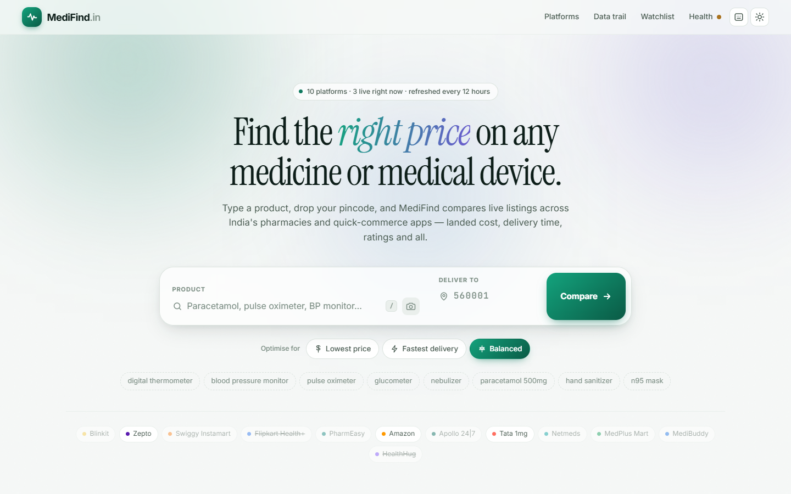
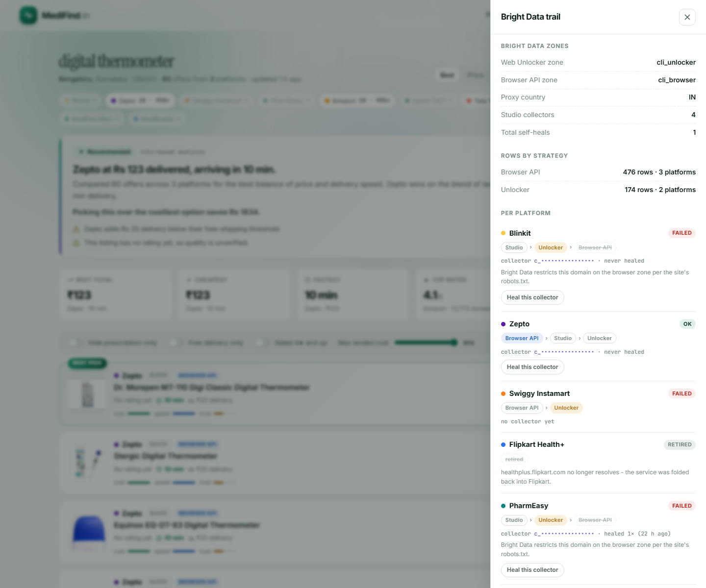
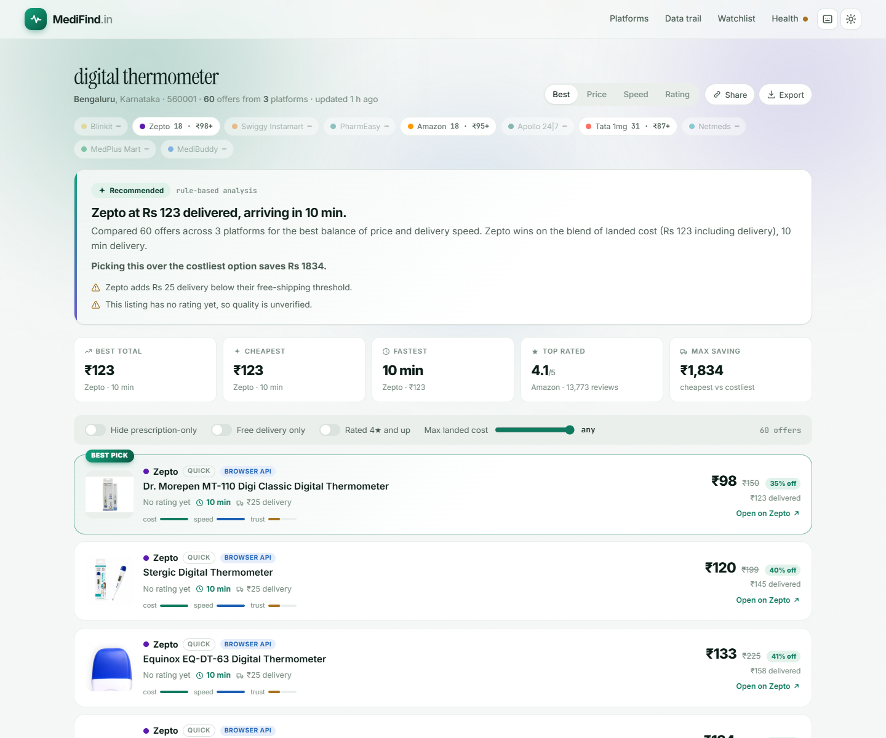
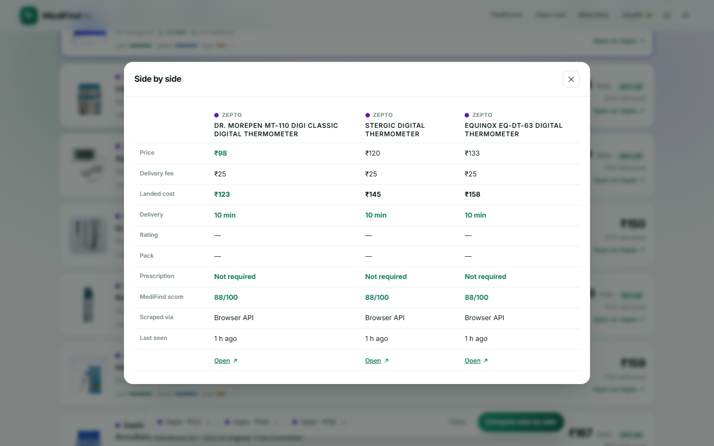
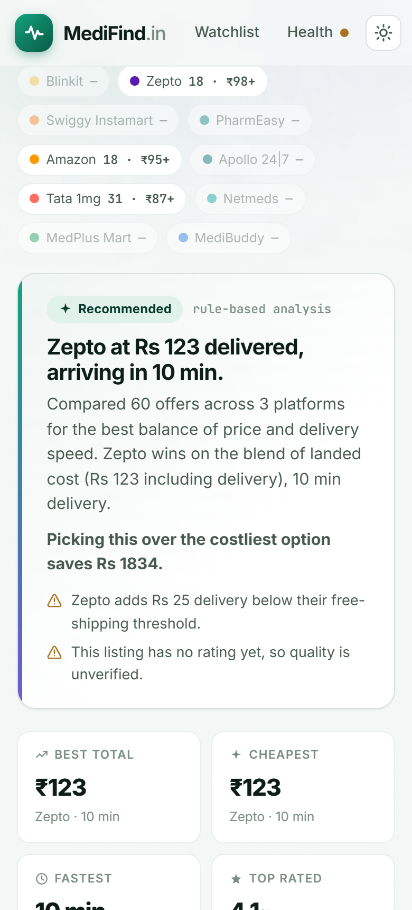
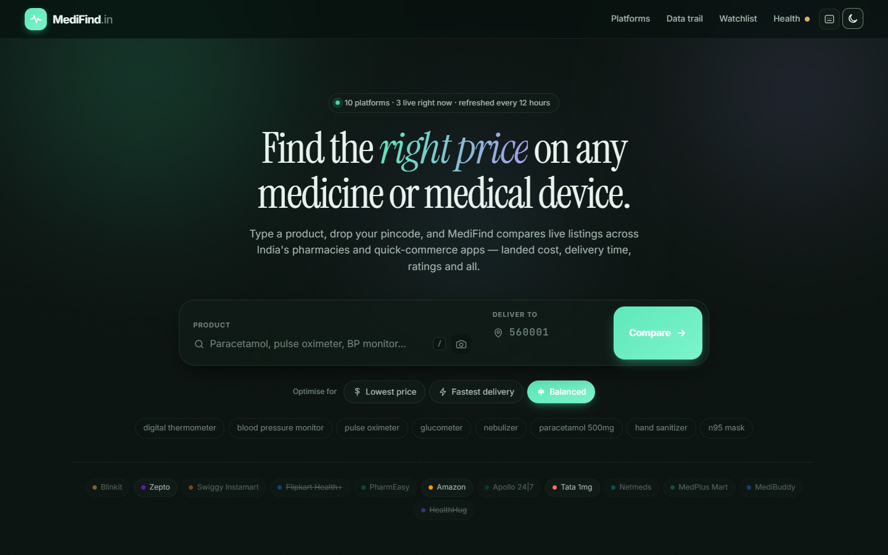

<div align="center">

# MediFind

**Compare the real, landed price of any medicine, home-use medical device or healthcare
supply across 10 Indian health commerce platforms — for your pincode.**

Built for [**Into the Scrape-Verse**](https://www.wemakedevs.org/hackathons/scrape-verse)
(WeMakeDevs × Bright Data, 17–23 Aug 2026) — the *build self-healing web scrapers* theme.

`Bright Data Scraper Studio` · `Browser API` · `Web Unlocker` · `Node 22` · `SQLite FTS5` · `local LLM`



</div>

---

## The problem

Search "digital thermometer" in Bengaluru and the cheapest landed cost is **₹123**; the most
expensive offer for the same search is **₹1,834 more**. Indian health commerce is split across
pharmacies, quick-commerce apps and marketplaces, each with its own delivery fee, its own ETA
and its own pincode coverage — and none of them show you the others. The sticker price is not
the price you pay.

MediFind scrapes all of them on a 12-hour cycle and ranks the results by **landed cost**
(price + delivery), modelled ETA and a damped trust score, for the pincode you actually live in.

> Measured on a real refresh: **4 platforms healthy, 522 rows** in one run
> ([`docs/evidence/refresh-summary.json`](docs/evidence/refresh-summary.json)) —
> **60 offers across 3 platforms** for a single "digital thermometer" query.

---

## Quickstart

Node **>= 22.5** and a Bright Data account are the only requirements.

```bash
git clone https://github.com/Fushiguro6286/medifind.git
cd medifind
npm install

npx -p @brightdata/cli bdata login   # once — stores the API key outside this repo
npm run refresh                      # populate the cache (~10 min, all platforms)
npm start                            # http://localhost:5173
```

Optional — a local LLM for ranking analysis and photo search:

```bash
ollama pull llama3.2   # ranking explanation and spell repair
ollama pull llava      # photo / camera search
```

**Without Ollama the app still works.** Ranking, comparison, autocomplete, filters and delivery
estimates are unaffected; the analysis text falls back to a rule-based writer and photo search
reports that it needs a vision model.

No secret ever lives in this repo. The Bright Data key is read from the CLI's own credentials
file, and every value in [`.env.example`](.env.example) has a working default.

---

## Scraper Studio is the core, not a checkbox

Four Scraper Studio collectors were created from the terminal with `bdata scraper create`,
AI-generated, run, and — in one case — healed. They are **not** pre-built Bright Data scrapers:
each was generated against a seed search URL with a natural-language extraction prompt.

**The collector IDs live in [`data/collectors.json`](data/collectors.json)**, which is
deliberately committed, resolved at runtime by `collectorFor(slug)`, and rendered per platform
in the app's **Data trail** panel. They are treated as production endpoints — read from that
registry, never hardcoded into logic. The full create-and-run log for the first collector is in
[`docs/evidence/`](docs/evidence/).



*The Data trail panel, live in the app. Collector IDs are masked in this screenshot only — the
panel renders them in full, each linked to its Bright Data console page.*

**Full write-up — how each collector was built, where it sits in the strategy ladder, how the
self-heal loop verifies itself, and what does not work:
[`docs/scraper-studio.md`](docs/scraper-studio.md).**

### Self-healing, with verification

When a platform returns zero *priced* rows, `runner.js` does not just log it:

```bash
bdata scraper heal <collector-id> "<symptom>" --url <seed-url> \
      --auto-approve --auto-save --json --pretty
```

1. The failure symptom is sent to Studio's AI healer.
2. The repair is auto-approved and saved.
3. **The collector is re-run to verify the repair actually produced rows.**
4. Only then is the platform's JSON snapshot rewritten.

Step 3 is the point. A heal that reports `status: done` but still returns nothing is **not**
treated as healed — otherwise the dashboard would proudly report a fixed scraper serving an
empty table. One real heal has run (PharmEasy); it completed, and it did *not* restore data,
because the root cause was a robots.txt policy block rather than a DOM change. That is recorded
honestly in `data/collectors.json` and shown as-is in the UI.

A heal is reachable three ways: automatically from the 12-hourly refresh, from the CLI
(`npm run studio:heal -- <slug> "<symptom>"`), and from **Data trail → Heal this collector** in
the UI, which posts to `POST /api/admin/heal/:slug` and runs the identical code path.

### Wired into a downstream system

| Where the collector ID goes | What it does |
|---|---|
| [`server/scheduler.js`](server/scheduler.js) | drives the 12-hourly refresh across all active platforms |
| [`server/scrape/runner.js`](server/scrape/runner.js) | resolves the collector per platform and runs it as a ladder rung |
| [`server/scrape/studio.js`](server/scrape/studio.js) | `collectorFor(slug)` reads the registry; heals write back to it |
| [`server/db.js`](server/db.js) | `products.source` records which rung produced each row; `companies.collector_id` and `heal_count` persist in SQLite |
| `GET /api/provenance` | serves the whole trail — zones, ladders, collector IDs, heal counts, rows by strategy |
| `POST /api/admin/heal/:slug` | triggers a verified heal from the dashboard |
| `data/companies/<slug>.json` | per-platform snapshot, rewritten only after a refresh completes |

---

## Reliability when a site changes

Two independent layers, because a scraper that only survives one kind of breakage is not
reliable — it is lucky.

### 1. The strategy ladder

Not every site can be scraped the same way, and the cheapest method that works wins:

1. **Scraper Studio collector** — an AI-built collector driving a real browser. The only rung
   that can repair itself when a site changes.
2. **Bright Data Browser API** — Playwright over CDP. Renders the page and can fill in a
   pincode itself. Leads on SPAs because it answers in ~25 s against a collector's minutes.
3. **Web Unlocker** — one cheap HTTP call. Enough for server-rendered sites like Amazon.

Platforms flagged `browserRestricted` drop rung 2 entirely rather than burning a 90-second
timeout on a domain Bright Data blocks per the site's robots.txt.

### 2. Four-tier extraction

[`server/scrape/extract.js`](server/scrape/extract.js) parses whatever comes back through
JSON-LD → SPA hydration state → a real DOM card walk → a markdown fallback. A site that changes
*how it renders* usually keeps working with no code change here at all.

```
                    ┌──────────────── every 12 h ────────────────┐
                    ▼                                            │
  scheduler.js ─► runner.js ─► strategy ladder ─► extract.js ─► SQLite + JSON
                    │              │                                  │
                    │              ├─ 1. Studio collector             │
                    │              ├─ 2. Bright Data browser (CDP)    │
                    │              └─ 3. Web Unlocker                 │
                    │                                                 │
                    └─ empty result ─► studio.js heal ─► verify ──────┘

  browser ─► /api/suggest    ─► FTS5 prefix search        (every keystroke)
          ─► /api/identify   ─► local vision model        (photo search)
          ─► /api/search     ─► cache ─► rank.js ─► local LLM explanation
          ─► /api/provenance ─► which Bright Data product produced each row
```

---

## The interface



Ranked offers. Every card carries a badge naming the **Bright Data product that scraped that
row**, the landed cost beside the sticker price, and cost / speed / trust bars so the ranking is
inspectable rather than asserted. The coverage strip above lists *every* platform for the query
— including the ones that returned nothing.

<table>
<tr>
<td width="62%"></td>
<td width="38%"></td>
</tr>
<tr>
<td><b>Side by side.</b> Stage up to four offers and compare them row by row, winner marked per row.</td>
<td><b>Responsive down to 390&nbsp;px</b>, with full keyboard navigation.</td>
</tr>
</table>



Dark mode, and a command palette on `Ctrl`/`Cmd` + `K`.

**Also in the UI:** type-ahead over SQLite FTS5 with a "did you mean" repair on a miss · photo
and camera search through a local vision model · filters for prescription-only, free delivery,
4★ and up, and a landed-cost ceiling · a watchlist that re-prices on your next search · share
links and CSV export.

### Ranking is deterministic

Ordering is computed in [`server/llm/rank.js`](server/llm/rank.js), **never by the model** — a
shopping result has a right answer and it must not drift between runs. Each offer scores on:

- **cost** — price *plus* delivery fee (landed cost), not the sticker price
- **speed** — ETA derived from the platform's fulfilment model and your pincode's city tier
- **trust** — rating damped by log-scaled review volume, so one 5-star review cannot outrank a
  4.4 with twelve thousand

Weights shift with *Lowest price* / *Fastest delivery* / *Balanced*. The LLM only explains the
result and flags trade-offs after the fact.

### Pincode serviceability

Indian PIN codes are hierarchical, so the first 2–3 digits give a state and city tier without a
licensed dataset. Quick-commerce platforms are metro-only; pharmacies courier nationally.
Verdicts are marked `modelled` unless a scrape confirmed them, and the UI never presents a guess
as a fact.

---

## Platform status, reported honestly

All ten active platforms are wired up and refreshed on the same cycle. They do not all *yield*
data, and the reasons differ:

| Platform | Status | Working strategy / blocker |
|---|---|---|
| Amazon | **live** | Web Unlocker, ~5 s |
| Zepto | **live** | Browser API, ~33 s |
| Apollo 24\|7 | **live** | Browser API, ~26 s |
| Tata 1mg | **live** | Browser API, ~86 s |
| Blinkit | blocked | Bright Data restricts `blinkit.com` on the browser zone **per robots.txt**. The browser rung is dropped; the Studio collector is the fallback path. |
| PharmEasy | blocked | Same robots.txt restriction. Studio collector built and healed; still returns 0 rows — a policy block, not a selector break. |
| Netmeds | needs work | Renders, but the catalogue stays behind its location gate. |
| Swiggy Instamart | needs work | Same — Instamart shows nothing until a serviceable address is set. |
| MedPlus Mart | needs work | Search URL not yet confirmed. |
| MediBuddy | needs work | Search URL not yet confirmed. |

Two platforms are **retired** — kept in the registry with a stated reason so the platform count
cannot silently drift, and never scraped:

| Platform | Why |
|---|---|
| Flipkart Health+ | `healthplus.flipkart.com` no longer resolves; the service was folded back into Flipkart. |
| HealthHug | `healthhug.com` publishes health articles, not a product catalogue. |

Each platform's search URL is a single line in [`server/companies.js`](server/companies.js).
Run `npm run doctor` after changing one to see immediately whether it returns rows.

---

## Commands

```bash
npm start                          # server + 12 h scheduler
npm run dev                        # with --watch
npm run refresh                    # refresh all active companies now
npm run refresh:one -- amazon      # one company
npm run doctor                     # probe which sites the Unlocker path can reach
npm run studio:bootstrap           # build Studio collectors (5-10 min each)
npm run studio:bootstrap -- zepto  # build one
npm run studio:heal -- zepto "price is null"
```

## API

| Endpoint | Purpose |
|---|---|
| `GET /api/suggest?q=` | type-ahead (+ `didYouMean` when the index misses) |
| `POST /api/search` | `{query, pincode, intent}` → ranked offers + analysis |
| `GET /api/coverage?q=` | per-platform coverage for one query |
| `POST /api/identify` | `{image}` base64 → product name |
| `GET /api/pincode/:pin` | city, state, and per-company serviceability |
| `GET /api/companies` | platform list with refresh + heal status |
| `GET /api/provenance` | Bright Data trail: zones, ladders, collector IDs, heals |
| `GET /api/status` | Bright Data, LLM, cache and schedule state |
| `GET /api/admin/runs` | recent refresh runs |
| `GET /api/admin/snapshot/:slug` | that company's cached JSON |
| `POST /api/admin/refresh` | trigger a refresh |
| `POST /api/admin/heal/:slug` | repair one Studio collector on demand |

## Repository map

```
server/
  scrape/    runner.js · studio.js · browser.js · extract.js   the ladder and the heal loop
  llm/       rank.js · suggest.js · vision.js · ollama.js      deterministic ranking, local LLM
  companies.js  catalog.js  pincode.js  db.js  scheduler.js    registry, FTS5, PIN model, cron
public/      index.html · app.js · style.css                   the whole front end, no build step
data/        collectors.json (committed)                       Studio collector registry
docs/        scraper-studio.md · evidence/ · images/           write-up, proof, screenshots
```

---

## Rules and limits

- **Only publicly available listing pages are scraped.** No login-protected, paywalled or
  restricted content — and the two domains Bright Data restricts per robots.txt are left
  restricted rather than worked around.
- **No pre-built Bright Data scrapers.** All four collectors were created from the terminal with
  `bdata scraper create` against a seed URL and a natural-language prompt.
- **No credentials in this repo.** The API key lives in the Bright Data CLI's own store.
- **Prices and ETAs are estimates from public listings.** Confirm on the seller's site before
  ordering — every offer card links straight to the product page.
- **Delivery ETAs are modelled**, not quoted by the platforms. They reflect each platform's
  fulfilment type and your city tier.
- Quick-commerce catalogues are genuinely pincode-dependent; the same search in a tier-3 pincode
  will legitimately return fewer platforms.
- This is a price-comparison tool, **not medical advice**. Prescription items are flagged but
  still require a valid prescription at checkout.
